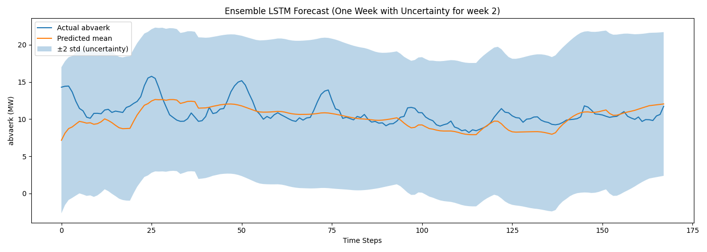
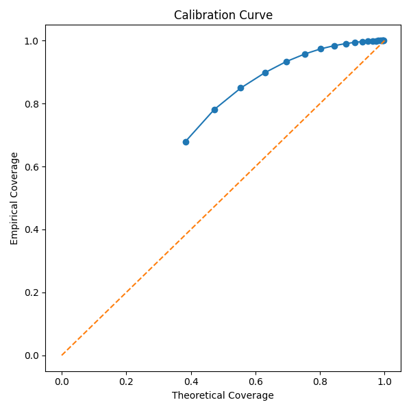

# Ensemble LSTM — Uncertainty Quantification Plots

Auto-generated by `EnsembleOutput.py`.

---

## What is the Ensemble?

Instead of training a single LSTM model, the ensemble trains **3 independent
models** with different random seeds. Each model sees the same data but starts from a
different random initialisation, producing slightly different predictions.

The spread across these predictions tells us how **uncertain** the model is:

| Uncertainty type | Source | Meaning |
|---|---|---|
| **Epistemic** | Disagreement between the 3 models | What the model *doesn't know* — reduces with more data/training |
| **Aleatoric** | Each model's own predicted variance (GaussianNLL output) | Inherent noise in the data — cannot be reduced |
| **Total** | Combined epistemic + aleatoric | The full predictive uncertainty |

Base model: `model.pth`

---

## Plots Overview

| File | Contents |
|---|---|
| `week_forecast_ensemble_week2.png` | One-week forecast with ±2σ uncertainty band |
| `calibration_curve.png` | Empirical vs theoretical coverage of prediction intervals |

The following plots are available but currently disabled — enable them in `EnsembleOutput.py`:

| File | Contents |
|---|---|
| `residuals_ensemble.png` | Ensemble residuals (actual − predicted mean) over time |
| `uncertainty_histogram.png` | Distribution of total predictive uncertainty (std) |
| `prediction_vs_actual.png` | Scatter of predicted mean vs actual abvaerk |
| `uncertainty_vs_error.png` | Scatter of predicted uncertainty vs absolute error |

---

## Weekly Forecast with Uncertainty

### What it shows
A single 168-hour (7-day) window from the test set. Three elements are plotted:
- **Actual abvaerk** (solid line) — the ground truth
- **Predicted mean** (solid line) — the ensemble average across all 3 models
- **±2σ band** (shaded) — the total uncertainty interval covering ~95% of a Gaussian

### How to interpret

| Pattern | Meaning |
|---|---|
| Actual stays inside the ±2σ band most of the time | Well-calibrated uncertainty — the model knows what it doesn't know |
| Actual frequently outside the band | Under-confident predictions — uncertainty is underestimated |
| Band is very wide throughout | Over-confident uncertainty estimate, or high inherent data noise |
| Band narrows at predictable hours (e.g. midday) and widens at transitions | Model is more certain at regular demand patterns — expected and healthy |
| Band widens beyond 24h and keeps growing | Normal: uncertainty accumulates with forecast distance |
| Band stays the same width regardless of horizon | Model may be collapsing to mean predictions at long horizons |
| Mean tracks actual well but band is very wide | Aleatoric uncertainty dominates — inherent noise in the demand signal |
| Mean drifts away from actual and band does not cover it | Systematic bias — model is missing a feature or pattern |

---

## Calibration Curve

### What it shows
The x-axis shows the **theoretical coverage** of a Gaussian interval (e.g. 68% for ±1σ,
95% for ±2σ). The y-axis shows the **empirical coverage** — the actual fraction of test
points that fell inside that interval. The dashed diagonal is the ideal: perfect
calibration.

Each point on the curve corresponds to a different σ multiplier (from 0.5σ to 3.0σ).

### How to interpret

| Pattern | Meaning |
|---|---|
| Curve follows the diagonal closely | Well-calibrated — stated confidence matches actual coverage ✓ |
| Curve is above the diagonal | **Conservative** (over-dispersed) — intervals are too wide; the model is more uncertain than it needs to be |
| Curve is below the diagonal | **Overconfident** (under-dispersed) — intervals are too narrow; the model underestimates uncertainty |
| Curve starts below diagonal then crosses above | Mixed calibration — well-calibrated at low confidence, over-dispersed at high confidence |
| Curve is flat / horizontal | Pathological — uncertainty estimates are not varying meaningfully |
| S-shaped curve | Bimodal error distribution — model behaves differently in two regimes (e.g. heating season vs summer) |

**Example — well-calibrated:** Points fall close to the diagonal across the full range.
The 95% interval actually contains ~95% of the data.

**Example — overconfident:** Points cluster below the diagonal. The stated 95% interval
only contains ~70% of the data — the model is too sure of itself.

**Example — under-trained ensemble:** Points cluster above the diagonal. The models
disagree too much (high epistemic uncertainty), making intervals unnecessarily wide.

---

## Optional Plots (currently disabled)

### Residuals Over Time
The difference (actual − predicted mean) plotted for every test timestep. Useful for
detecting systematic bias over time or at certain periods (e.g. winter peaks).

### Uncertainty Distribution
Histogram of total predictive std across all test timesteps. A narrow, peaked histogram
means the model has similar confidence everywhere. A wide or multi-modal histogram means
uncertainty varies significantly (e.g. higher in winter, lower in summer).

### Predicted vs Actual Scatter
Each point is one timestep. Points on the diagonal = perfect prediction. Fan shape =
heteroscedastic error (larger errors at high demand values).

### Uncertainty vs Error
Scatter of predicted std (x) vs absolute error (y). If the model is well-calibrated,
there should be a positive correlation — higher stated uncertainty should correspond to
higher actual errors. A flat cloud means uncertainty estimates are uninformative.

---

## General Notes

- All plots use the **test set only** — the ensemble never saw this data during training.
- The ensemble was trained with **GaussianNLLLoss**, so each model outputs both a
  predicted mean and a predicted variance. Aleatoric uncertainty comes from the variance
  output; epistemic uncertainty comes from disagreement between the 3 models.
- A larger ensemble (more models) reduces the variance of the epistemic uncertainty
  estimate but increases training time proportionally.
