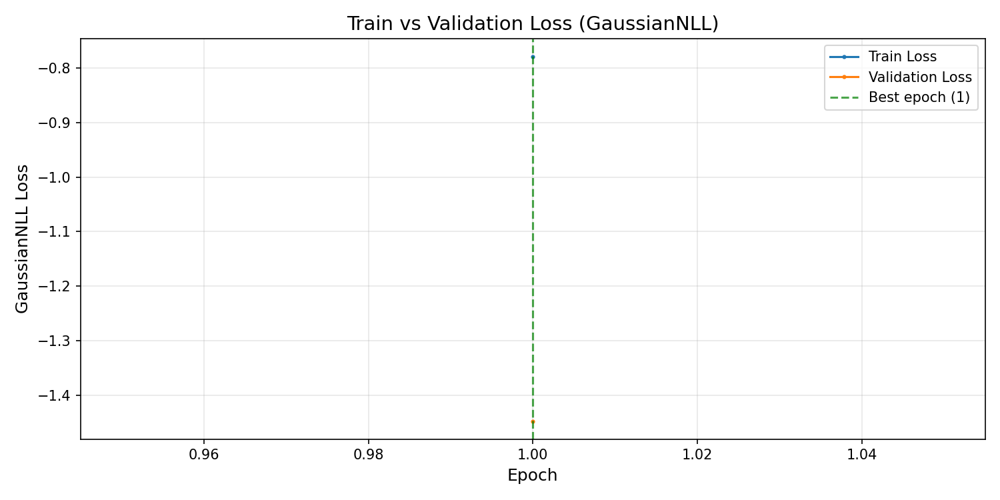

# LSTM Training Run — Summary

Auto-generated by `LSTMTraining.py` on 2026-03-09 15:50:51.

---

## Model

| Property | Value |
|---|---|
| Checkpoint file | `model_v1.pth` |
| Best checkpoint epoch | 1 |
| Best validation loss (GaussianNLL) | -1.447560 |
| Total epochs run | 1 |
| Early stopping triggered | No — ran to completion |

---

## Dataset Split

| Split | Samples | Percentage |
|---|---|---|
| Train | 13766 | 80.0% |
| Validation | 1720 | 10.0% |
| Test | 1720 | 10.0% |
| **Total** | **17206** | **100%** |

The split is **chronological** — no data leakage. The test set is always the most
recent 10.0% of the data and is never touched during training.

---

## Hyperparameters (Config)

| Parameter | Value |
|---|---|
| `batch_size` | 32 |
| `decoder_features` | 11 |
| `device` | cpu |
| `dropout` | 0.39279757672456206 |
| `encoder_features` | 8 |
| `encoder_history` | 168 |
| `epochs` | 1 |
| `forecast_length` | 168 |
| `hidden_size` | 128 |
| `learning_rate` | 0.005399484409787433 |
| `num_layers` | 4 |
| `output_size` | 1 |
| `tuned_config_path` | NewModelFolder/Files/HPTTuning.json |
---

## Loss Curve

The training and validation loss curve is generated automatically alongside this README.

### How to interpret it

| Pattern | Meaning |
|---|---|
| Both curves decrease together | Training is progressing correctly |
| Val loss plateaus while train loss keeps falling | Overfitting — consider more dropout or less capacity |
| Both curves are flat from the start | Learning rate too low, or gradient issue |
| Loss spikes during training | Gradient explosion — check grad clipping |
| Best epoch is very early | Early stopping may have fired too soon — consider raising patience |
| Best epoch is near the configured max | Model may still improve with more epochs |

---

## Notes

- Loss function: **GaussianNLLLoss** — the model outputs a mean (`mu`) and
  log-variance (`log_var`) for each forecast step. The loss rewards both
  accurate point predictions and well-calibrated uncertainty estimates.
- Gradient clipping is applied at `max_norm = 1.0` per step to prevent
  exploding gradients in the 168-step sequence.
- The learning rate scheduler (`ReduceLROnPlateau`, factor=0.5, patience=3)
  halves the learning rate whenever validation loss stops improving.
